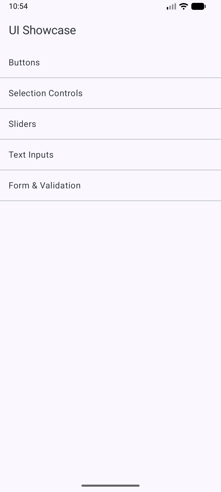
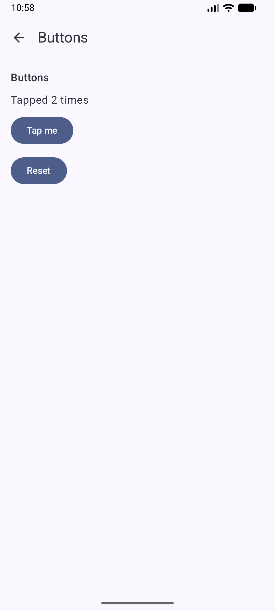
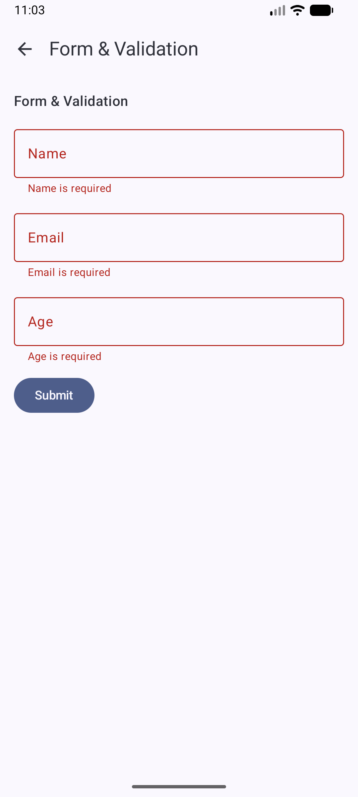

# Swift-driven UI showcase

A "kitchen sink" catalog app where **Swift declares the UI and owns all of its
state**, and Kotlin is only a thin generic renderer. Browse screens that demo
buttons, selection controls (switch, checkboxes, radio group), sliders, text
inputs, and a form with validation — every component you see was declared by
Swift code, and every interaction is handled by Swift code.

| Home (Swift's screen registry) | Buttons (Swift tap counter) | Form (Swift validation) |
|---|---|---|
|  |  |  |

## Overview

The example consists of two components:

- **showcase-lib**: A Swift package (`ShowcaseKit`) that declares the component
  tree of every screen, holds all UI state, reduces every action, and validates
  the form. It is exposed to Java by
  [swift-java](https://github.com/swiftlang/swift-java)'s JExtract in JNI mode.
- **showcase-app**: A Kotlin Android app whose Compose code never hard-codes a
  screen. It interprets whatever component tree Swift returns
  (`ComponentRenderer.kt` is a single `when` over the component kind) and
  builds its navigation graph from Swift's screen registry.

Jetpack Compose cannot be called from Swift (composables are a Kotlin compiler
feature), so "the UI is written in Swift" takes this shape: a unidirectional
data-flow loop with Swift as the single source of truth.

```
        Compose (Kotlin)                              ShowcaseKit (Swift)
  ┌──────────────────────────┐                 ┌────────────────────────────┐
  │ user taps / types / drags │──── action ───▶│ showcaseDispatch(screen,   │
  │                          │    (JSON)       │   component, action)       │
  │ render component tree    │                 │   → screen reduces action, │
  │ (one `when` over "kind") │◀─ new screen ───│     mutates its Swift state│
  └──────────────────────────┘    (JSON)       └────────────────────────────┘
```

Only three functions cross the boundary, all `(String...) -> String`
(see `showcase-lib/Sources/ShowcaseKit/ShowcaseAPI.swift`):

| Function | Purpose |
|---|---|
| `showcaseScreens()` | Screen registry (ids + titles) — drives the navigation graph |
| `showcaseScreen(id)` | Current component tree of one screen |
| `showcaseDispatch(screenId, componentId, actionJSON)` | Apply a user action, return the new tree |

Because state lives in Swift, it survives navigation: toggle a switch, leave
the screen, come back — the switch is still on, with no ViewModel or saved
state on the Kotlin side.

## Prerequisites

Same as [hello-swift-java](../hello-swift-java/README.md): a Swift 6.3+
toolchain via `swiftly`, the Swift SDK for Android, and the `swiftkit-core`
package published to your local Maven repository. Follow the
[Setup and Configuration](../hello-swift-java/README.md#setup-and-configuration)
steps there (run the `swift package resolve` / `publishToMavenLocal` step from
`swift-java-ui-showcase/showcase-lib` or any other swift-java example module —
the published package is shared).

## Running the example

```console
./gradlew :swift-java-ui-showcase-showcase-app:assembleDebug
```

or open the repository in Android Studio and run the
`swift-java-ui-showcase-showcase-app` configuration on an emulator or device.

To iterate on the Swift model without an Android device, the package is plain
Swift — build and test it on your host machine:

```console
cd swift-java-ui-showcase/showcase-lib
swift test
```

## JSON schema

The wire format between Swift and Kotlin. Every component is a flat JSON
object discriminated by `"kind"`; the schema is pinned by
`buttonsScreenSchemaIsStable()` in
`showcase-lib/Tests/ShowcaseKitTests/ShowcaseKitTests.swift` — update this
table and that test together.

`showcaseScreens()` returns `{"screens": [{"id", "title"}, ...]}`.
`showcaseScreen(id)` and `showcaseDispatch(...)` return
`{"id", "title", "components": [...]}` where each component is:

| `kind` | Keys | Actions it emits |
|---|---|---|
| `sectionHeader` | `id`, `text` | — |
| `text` | `id`, `text` | — |
| `button` | `id`, `label`, `role` (`primary`\|`secondary`) | `{"type":"tap"}` |
| `toggle` | `id`, `label`, `isOn` | `{"type":"setBool","value":…}` |
| `checkbox` | `id`, `label`, `isChecked` | `{"type":"setBool","value":…}` |
| `radioGroup` | `id`, `label`, `options`, `selectedIndex` (nullable) | `{"type":"select","index":…}` |
| `segmentedControl` | `id`, `label`, `options`, `selectedIndex` | `{"type":"select","index":…}` |
| `slider` | `id`, `label`, `value`, `min`, `max` | `{"type":"setNumber","value":…}` |
| `progressIndicator` | `id`, `label`, `value` (`0.0`–`1.0`) | — (display-only) |
| `stepper` | `id`, `label`, `value`, `min`, `max` (all `Int`) | `{"type":"setNumber","value":±1}` (a delta, not the new value) |
| `datePicker` | `id`, `label`, `date` (`"yyyy-MM-dd"`) | `{"type":"setString","value":…}` |
| `alert` | `id`, `title`, `message`, `confirmLabel`, `cancelLabel` | `{"type":"select","index":0}` (confirm) or `{"type":"select","index":1}` (cancel/dismiss) |
| `textField` | `id`, `label`, `text`, `placeholder`, `keyboard` (`text`\|`email`\|`number`), `error` (nullable) | `{"type":"setString","value":…}` |
| `textEditor` | `id`, `label`, `text`, `placeholder` | `{"type":"setString","value":…}` |
| `code` | `id`, `title`, `code` | — (opens a fullscreen modal with Copy and Wrap actions; modal visibility and wrap state stay Kotlin-local) |

## Add your own screen (~20 lines, no Kotlin)

Conform to `ScreenDefinition` in its own file under
`showcase-lib/Sources/ShowcaseKit/` (one screen per file, e.g. `ButtonsScreen.swift`):

```swift
final class GreetingScreen: ScreenDefinition {
  let id = "greeting"
  let title = "Greeting"

  private var name = ""

  func reduce(_ action: Action, componentId: String) {
    if case .setString(let value) = action, componentId == "name" { name = value }
  }

  func body() -> [Component] {
    [
      .textField(id: "name", label: "Your name", text: name,
                 placeholder: "World", keyboard: .text, error: nil),
      .text(id: "greeting", text: "Hello, \(name.isEmpty ? "World" : name)!"),
    ]
  }
}
```

then append `GreetingScreen()` to `defaultScreens()` in `ScreenRegistry.swift`.
That's it — the home list and navigation are data-driven from Swift's
registry, so the new screen appears with no Kotlin changes.

## Add your own component kind

Four touch points:

1. A new case on `Component` in `showcase-lib/Sources/ShowcaseKit/Component.swift`
2. Its `encode(to:)` / `init(from:)` clauses in the same file
3. A new branch in the `when` in `showcase-app/.../ComponentRenderer.kt`
4. A row in the schema table above (and, if you change existing shapes, the
   pinned-schema test)

## Troubleshooting

See the [hello-swift-java troubleshooting section](../hello-swift-java/README.md#troubleshooting).
The two paths in `showcase-lib/build.gradle` that hardcode the Swift target
name (`Sources/ShowcaseKit` and the JExtract generated-java output directory)
are the usual suspects if generated Java classes are missing or stale after
renaming things.
